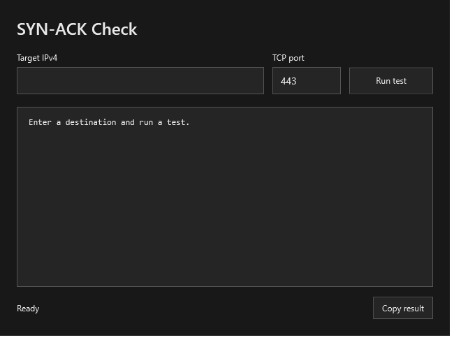
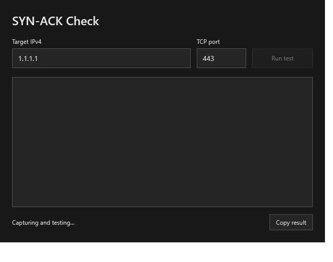
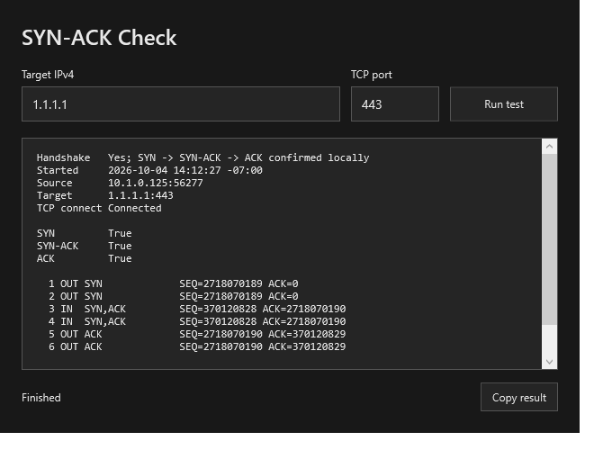

<h1 align="center">SYN-ACK Check</h1>

<p align="center">
  TCP handshake checker for network troubleshooting.
</p>

---

A Windows PowerShell GUI for inspecting a single outbound TCP connection.

## Install

Save `synack-check.ps1`, open Windows PowerShell as administrator, and run:

```powershell
powershell.exe -NoProfile -STA -File .\synack-check.ps1
```

## What it does

Starts a short Pktmon capture, attempts a TCP connection and matches the SYN → SYN-ACK → ACK flow using sequence and acknowledgment numbers. Shows the connection result, packet details and a filtered PCAPNG saved under `%LOCALAPPDATA%\TcpHandshake-*`.

## Output

Screenshots from the native Windows 11 validation.

**Ready.** Enter the destination IPv4 address and TCP port.



**Capturing.** The test runs in the background; **Run test** remains disabled until it finishes.



**Completed.** `Handshake` reports the verdict. `SYN`, `SYN-ACK` and `ACK` show matched steps as `True` or `False`; `False` means the capture did not confirm that step.


